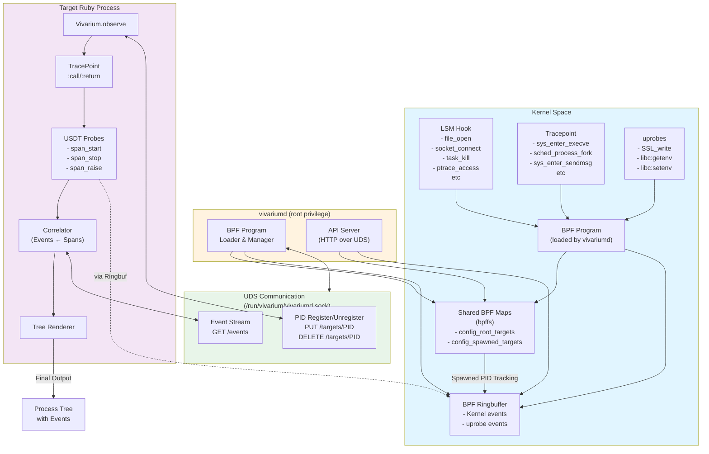

# Vivarium Architecture

System architecture diagram of Vivarium.



## Components Description

### 1. **vivariumd (Run with root privilege)**
- Load BPF program into the kernel
- Enable LSM Hook, Tracepoint, and uprobe
- Manage Shared BPF Maps (bpffs)
- Communicate with clients via HTTP API over Unix Domain Socket (UDS)

### 2. **Kernel Space Event Sources**

#### LSM Hook (Linux Security Module)
- `file_open` - When a file is opened
- `socket_connect` - When a socket connects
- `socket_create` - When a socket is created
- `task_kill` - When a signal is sent
- `ptrace_access_check` - When ptrace is attempted
- Others: `sb_mount`, `kernel_read_file`, `capable_check`, etc.

#### Tracepoint
- `sys_enter_execve` - When a process is executed
- `sched_process_fork` - When a process forks (spawn tracking)
- `sys_enter_sendmsg/sendto/sendmmsg` - When DNS is sent
- `sys_enter_getdents64` - When directory entries are read

#### uprobes
- **libssl**: `SSL_write` - Monitor SSL communication
- **libc**: `getenv`, `setenv`, `unsetenv`, `putenv`, `clearenv` - Monitor environment variable access
- **Vivarium USDT Probe**: `span_start`, `span_stop`, `span_raise` - Ruby method boundaries

### 3. **Shared BPF Maps** (pinned on bpffs: `/sys/fs/bpf/vivarium/`)
- `config_root_targets` - Root PID map (registered by user-side)
- `config_spawned_targets` - Spawned TID map (automatically tracked by sched_process_fork)
- `events` - BPF_RINGBUF_OUTPUT (event delivery)

### 4. **BPF Ringbuffer**
- **Kernel events**: Fired from LSM Hook and Tracepoint
- **USDT events** (`span_start`, `span_stop`, `span_raise`): Fired from Ruby process via uprobe
- Event structure `event_t`:
  ```c
  {
    u64 ktime_ns;    // Kernel timestamp
    u32 pid;         // Process ID
    u32 tid;         // Thread ID
    char event_name[16];    // Event name
    char payload[256];      // Payload (device-specific)
  }
  ```

### 5. **Target Ruby Process**
- Monitor code within `Vivarium.observe { ... }` block
- **TracePoint** (`:call`, `:return`): Detect Ruby method calls
- **USDT Probe** (Ruby::Box): Fire uprobe with `span_start`, `span_stop`, `span_raise`
- These events are sent to vivariumd **via Ringbuf**
- **Correlator**: Correlate kernel events received from Ringbuf to Span by timestamp and TID
- **Tree Renderer**: Visualize method tree and events

### 6. **UDS Communication** (Unix Domain Socket)
Communicate via HTTP-over-UDS:
- `PUT /targets/{pid}` - Register PID as observation target → record in `config_root_targets`
- `DELETE /targets/{pid}` - Unregister
- `GET /events` - Open event stream (chunked response)
- `GET /healthz` - Health check

## Data Flow

1. **Initialization**: Ruby process calls `Vivarium.observe`
2. **PID Registration**: Register PID to vivariumd via UDS → record in `config_root_targets`
3. **Fork Tracking**: `sched_process_fork` Tracepoint automatically records Spawned TID in `config_spawned_targets`
4. **Event Generation**: LSM Hook/Tracepoint/uprobe output events to Ringbuf
5. **USDT Firing**: Ruby TracePoint :call/:return fires USDT probe → span_start/span_stop events
6. **Event Reception**: Correlator reads Ringbuf events via UDS
7. **Correlation**: Assign kernel events within span_start/span_stop time window to corresponding Span
8. **Visualization**: Display method tree and event history as final output
